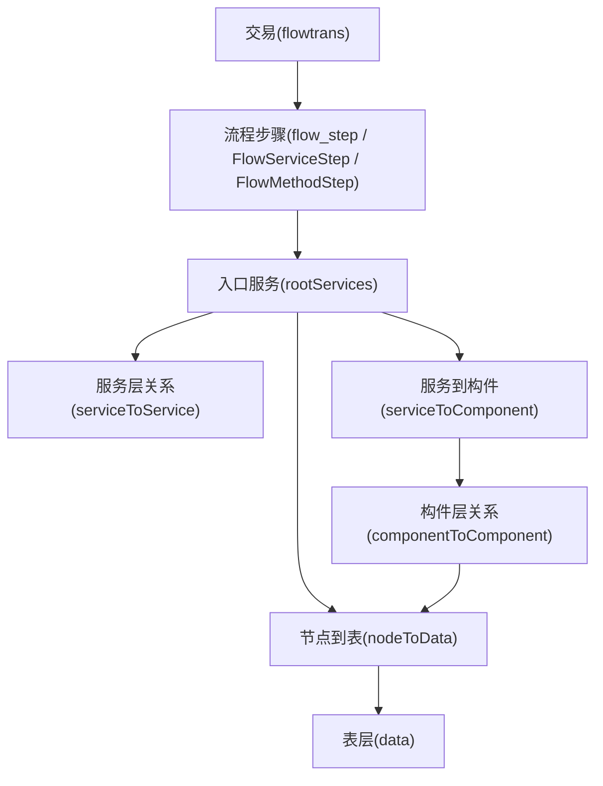
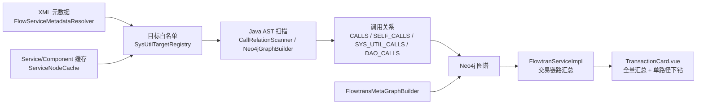
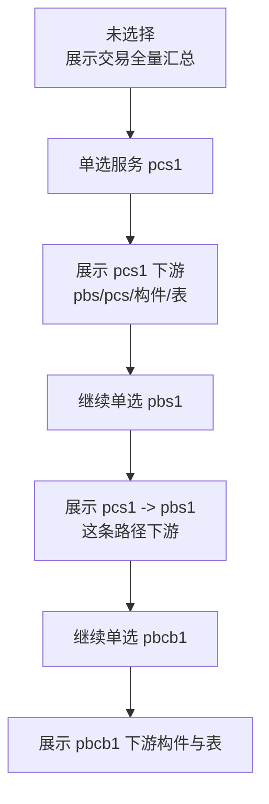

# 设计文档: 交易分层调用链路与 SysUtil 编码调用汇总

**Feature Branch**: `001-flowtran-domain-tx`  
**Created**: 2026-03-30  
**Status**: Draft  

---

## 1. 目标

本设计用于支撑“从交易层查看调用链”的增强能力，核心目标有两条：

1. 以交易为入口，汇总展示这笔交易调用了哪些服务、哪些构件、哪些表。
2. 在全量汇总的基础上，支持沿单条调用线路逐层下钻，持续看到某个服务或构件最终落到了哪些表。

本次设计覆盖以下对象类型：

- 服务层: `pbs`、`pcs`
- 构件层: `pbcb`、`pbcp`
- 下层构件: `pbcc`、`pbct`
- 数据层: 表

并统一纳入 `SysUtil.getInstance(...)` 的编码式调用采集。

---

## 2. 用户视角

### 2.1 默认视图

当用户进入某笔交易详情且未做单选时，页面展示当前交易的全量分层汇总结果：

- 流程编排入口服务
- 服务层下游 `pbs/pcs`
- 构件层下游 `pbcb/pbcp`
- 下层构件 `pbcc/pbct`
- 最终涉及表

### 2.2 单路径下钻

当用户在服务层或构件层做单选后，页面切换为单路径下钻模式：

- 先选某个服务，只看该服务下游
- 再选其子服务，只看这条路径后续下游
- 再选某个构件，继续看到其下游构件及表

约束：

- 一条线往下只能单选
- 单选后只展示当前选中路径的下游
- 支持持续叠加选择直到表层

---

## 3. 关键业务规则

### 3.1 节点类型识别

节点的 `prefix` 必须是真实业务类型，不允许再仅靠 Java 类名后缀猜测。

识别来源如下：

- `pbs/pcs`
  - 由 `*.pbs.xml`、`*.pcs.xml`
  - 以及 `*.pbsImpl.xml`、`*.pcsImpl.xml`
  - 或 `*.serviceType.xml` 兜底
- `pbcb/pbcp/pbcc/pbct`
  - 由 `*.pbcb.xml`、`*.pbcp.xml`、`*.pbcc.xml`、`*.pbct.xml`
  - 以及对应 `*Impl.xml`
  - 若当前工程无对应 XML，则回退服务/构件缓存

### 3.2 领域归属识别

节点必须带所属领域信息，用于页面跨域提示与展示。

领域推断优先级：

1. XML 所属工程名推断
2. 缓存中的 `domainKey`
3. `packagePath` 解析兜底
4. 交易领域兜底

父工程与领域映射规则：

| 父工程 | 领域 |
|-------|------|
| `ap-parent` | `ap` |
| `dept-parent` | `dept` |
| `unvr-parent` | `unvr` |
| `stmt-parent` | `stmt` |
| `medu-parent` | `medu` |
| `inbu-parent` | `inbu` |
| `aggr-parent` | `aggr` |

### 3.3 SysUtil 采集规则

只采集命中正式服务/构件白名单的目标类型：

- `pbs`
- `pcs`
- `pbcb`
- `pbcp`
- `pbcc`
- `pbct`

不在白名单中的类型一律不采集，因此这类模型对象会被自然排除：

- `*Type`
- `*Pojo`
- 嵌套 Pojo
- 其他非服务/构件类

### 3.4 方法传递规则

不能只看“当前方法直接写了 `SysUtil.getInstance(...)`”。

以下链路都必须能被归并到入口服务：

- 直接链式调用  
  `SysUtil.getInstance(X.class).query(...)`
- 变量式调用  
  `a = SysUtil.getInstance(X.class); a.query(...)`
- 内部方法传递  
  `A() -> B() -> C() -> getInstance(X.class)`
- 静态方法传递  
  `A() -> Util.call() -> getInstance(X.class)`

---

## 4. 总体架构

### 4.1 采集与展示链路

---

## 5. 后端设计

## 5.1 XML 元数据层

负责统一解析服务/构件定义 XML，并补充：

- `typeId`
- `nodeKind`
- `domainKey`
- `packagePath`
- `definitionFilePath`
- `implFilePath`
- `module`
- `parentProject`

实现类：

- `/Users/wangshanhe/Desktop/myproject/axon-link-server/src/main/java/com/axonlink/service/FlowServiceMetadataResolver.java`

关键点：

- 兼容 `serviceType/pbs/pcs/pbcb/pbcp/pbcc/pbct`
- 兼容对应 `*Impl.xml`
- 模块级优先 `src/main/resources`
- 没有源码资源目录时回退 `target/classes`
- 通过工程名优先推断领域

### 5.1.1 当前实现位置

- 元数据文件扫描: `collectFiles(...)`
- XML 后缀识别类型: `inferNodeKind(...)`
- 工程名推断领域: `resolveDomainKey(...)`

## 5.2 SysUtil 白名单层

负责把“哪些类型允许被 `SysUtil.getInstance(...)` 采集”统一收口。

实现类：

- `/Users/wangshanhe/Desktop/myproject/axon-link-server/src/main/java/com/axonlink/service/SysUtilTargetRegistry.java`

数据来源：

- `FlowServiceMetadataResolver`
- `ServiceNodeCache`

输出能力：

- `containsTypeId(typeId)`
- `findByTypeId(typeId)`

返回元数据：

- `typeId`
- `nodeKind`
- `domainKey`
- `serviceName`
- `serviceLongname`
- `packagePath`
- `definitionFilePath`
- `implFilePath`

## 5.3 调用关系扫描层

### 5.3.1 call_relation 扫描

实现类：

- `/Users/wangshanhe/Desktop/myproject/axon-link-server/src/main/java/com/axonlink/service/CallRelationScanner.java`

职责：

- 扫描含 `SysUtil.getInstance` 的 Java 文件
- 识别链式调用与变量式调用
- 通过白名单过滤无效目标
- 识别服务/构件调用类型与领域
- 写入 `call_relation`

支持的形式：

- `SysUtil.getInstance(X.class).query(...)`
- `a = SysUtil.getInstance(X.class); a.query(...)`

### 5.3.2 Neo4j AST 图构建

实现类：

- `/Users/wangshanhe/Desktop/myproject/axon-link-server/src/main/java/com/axonlink/service/Neo4jGraphBuilder.java`

职责：

- 解析 Java 类、接口、方法
- 写入 `CALLS`
- 写入 `SELF_CALLS`
- 写入 `SYS_UTIL_CALLS`
- 写入 `DAO_CALLS`

`SYS_UTIL_CALLS` 目标也统一使用白名单，不再依赖 `Type/Pojo` 后缀排除。

## 5.4 Flowtrans 图谱层

实现类：

- `/Users/wangshanhe/Desktop/myproject/axon-link-server/src/main/java/com/axonlink/service/FlowtransMetaGraphBuilder.java`

职责：

- 导入 `flowtrans.xml`
- 导入 `serviceType/pbs/pcs/pbcb/pbcp/pbcc/pbct` 元数据
- 建立 `Transaction -> FlowStep -> ServiceType -> ServiceOperation` 图
- 为后续实现方法与调用链打通入口

## 5.5 交易链路汇总层

实现类：

- `/Users/wangshanhe/Desktop/myproject/axon-link-server/src/main/java/com/axonlink/service/impl/FlowtranServiceImpl.java`

职责：

1. 从交易节点获取流程编排入口服务
2. 递归发现服务层下游
3. 汇总服务到构件
4. 递归发现构件到构件
5. 汇总所有表
6. 输出前端所需分层结构

### 5.5.1 后端返回模型

`chain.relations` 当前包含：

- `rootServices`
- `serviceToService`
- `serviceToComponent`
- `componentToComponent`
- `componentToData`
- `nodeToData`

`chain` 当前包含：

- `orchestration`
- `service`
- `component`
- `data`
- `relations`

### 5.5.2 节点展示元数据组装

`displayNode(...)` 会统一补齐：

- `prefix`
- `code`
- `name`
- `domainKey`
- `domain`

优先级：

1. XML 元数据
2. `ServiceNodeCache`
3. 现有链路传入值
4. 交易领域兜底

这确保服务与构件节点在前端都能稳定拿到：

- `pbs/pcs/pbcb/pbcp/pbcc/pbct`
- 所属领域

## 5.6 源码定位辅助

实现类：

- `/Users/wangshanhe/Desktop/myproject/axon-link-server/src/main/java/com/axonlink/controller/SourceController.java`

职责：

- 通过 `typeId` 反查 XML 文件
- 优先返回源码资源目录下的 XML
- 在 Neo4j 无法直接命中时也能打开服务定义或实现 XML

---

## 6. 图数据库设计

## 6.1 主要节点

- `Transaction`
- `FlowBlock`
- `FlowMethodStep`
- `FlowServiceStep`
- `ServiceType`
- `ServiceOperation`
- `Class`
- `Interface`
- `Method`
- `Dao`

## 6.2 主要关系

- `HAS_FLOW`
- `HAS_STEP`
- `CALLS_SERVICE`
- `DECLARES_OPERATION`
- `IMPLEMENTS_BY`
- `CALLS`
- `SELF_CALLS`
- `SYS_UTIL_CALLS`
- `DAO_CALLS`

## 6.3 分层汇总的关键关系

从交易汇总层视角，真正驱动页面分层的是以下几组逻辑关系：

- `rootServices`
  - 交易流程编排直接入口服务
- `serviceToService`
  - 服务到服务
- `serviceToComponent`
  - 服务到构件
- `componentToComponent`
  - 构件到构件
- `nodeToData`
  - 服务/构件到表

---

## 7. 前端设计

实现文件：

- `/Users/wangshanhe/Desktop/myproject/axon-link-server/frontend/src/components/TransactionCard.vue`

## 7.1 展示模式

### 7.1.1 默认模式

未选择任何服务/构件时：

- 展示当前交易的全量分层汇总
- 服务层展示所有下游服务
- 构件层展示所有可达构件
- 数据层展示所有可达表

### 7.1.2 下钻模式

有选择时：

- `serviceTrail` 保存当前服务选择路径
- `bizComp` 保存业务/产品构件选择
- `techComp` 保存公共/技术构件选择

路径规则：

- 点击服务入口，建立路径
- 点击当前路径子服务，追加路径
- 点击已选中服务，回退路径
- 点击构件后，只展示该构件可达下游和表

## 7.2 分层数据裁剪

前端核心计算：

- `collectServiceClosure(...)`
- `collectComponentsForService(...)`
- `collectTablesForService(...)`
- `collectTablesForComponent(...)`

它们共同完成：

- 默认全量汇总
- 服务路径下钻
- 构件路径下钻

## 7.3 领域标签展示

当前展示口径：

- 节点都携带 `domain/domainKey`
- 前端以交易所属领域为基准
- 只有“跨领域调用”时才展示领域标签
- 标签仍保留跨域箭头视觉提示

---

## 8. 单路径下钻交互图

---

## 9. 代码落点清单

| 模块 | 文件 | 作用 |
|------|------|------|
| XML 元数据 | `src/main/java/com/axonlink/service/FlowServiceMetadataResolver.java` | 解析 XML，补齐类型与领域 |
| SysUtil 白名单 | `src/main/java/com/axonlink/service/SysUtilTargetRegistry.java` | 统一目标识别 |
| 调用关系扫描 | `src/main/java/com/axonlink/service/CallRelationScanner.java` | 生成 `call_relation` |
| AST 图谱 | `src/main/java/com/axonlink/service/Neo4jGraphBuilder.java` | 写入 `SYS_UTIL_CALLS` 等边 |
| Flowtrans 图谱 | `src/main/java/com/axonlink/service/FlowtransMetaGraphBuilder.java` | 交易与服务元数据入图 |
| 交易链路汇总 | `src/main/java/com/axonlink/service/impl/FlowtranServiceImpl.java` | 交易层分层汇总与下钻结果 |
| 源码定位 | `src/main/java/com/axonlink/controller/SourceController.java` | XML/Java 源码查找 |
| 前端展示 | `frontend/src/components/TransactionCard.vue` | 分层展示与单路径下钻 |

---

## 10. 验证方式

## 10.1 构建验证

- 后端编译  
  `mvn -q -DskipTests compile`
- 前端打包  
  `npm --prefix frontend run build`

## 10.2 数据重建

在规则或元数据变更后，应重跑：

1. 调用关系扫描
2. Neo4j 图构建 `/api/neo4j/build`

## 10.3 业务验证建议

以内网真实工程和真实交易验证以下场景：

1. 某笔交易默认能看到完整服务/构件/表汇总
2. 选择某个 `pcs` 后能收敛到该服务下游
3. 继续选择 `pbs` 后路径继续收敛
4. 继续选择 `pbcb/pbcc` 后能看到最终表
5. `SysUtil.getInstance(...)` 的变量式与传递式调用不会断档
6. `Type/Pojo` 等模型对象不会误采
7. 节点前缀能正确显示 `pbs/pcs/pbcb/pbcp/pbcc/pbct`
8. 只有跨领域调用时显示领域标签

---

## 11. 已知限制

1. 外网本地环境与内网工程结构不完全一致，真实验证仍以内网结果为准。
2. 当前外网本地数据源 `service/component` 缓存为空，无法完全还原内网业务数据。
3. 某些构件类型如果内网工程才有对应 XML，则最终展示效果需以内网重建后的结果为准。

---

## 12. 结论

本设计把“交易 -> 服务 -> 构件 -> 表”统一收口成一套可递归、可下钻、可跨域展示的分层调用模型。

其核心价值在于：

- 统一了 XML 元数据、缓存、AST 调用与图谱口径
- 统一了 `SysUtil.getInstance(...)` 的正式目标采集规则
- 统一了页面默认汇总与单路径下钻的交互模型
- 统一了节点类型标识与领域归属展示

后续若内网测试发现偏差，只需要继续围绕以下三类问题修正即可：

- 节点识别规则
- 调用传递归并规则
- 分层展示裁剪规则
