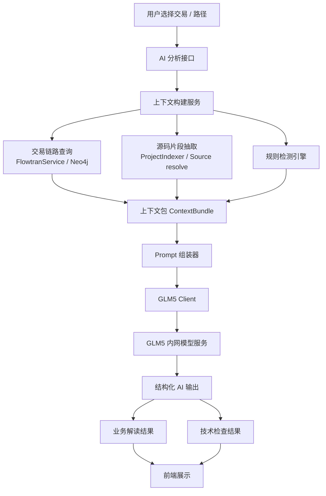

# 设计文档: 基于交易链路图的 AI 代码解读与技术检查

**Feature Branch**: `002-ai-code-analysis`  
**Created**: 2026-04-01  
**Status**: Draft  

---

## 1. 背景与目标

当前 AxonLink 已具备以下基础能力：

- 解析 `*.flowtrans.xml`、`*.serviceType.xml`、`*.pbs.xml`、`*.pcs.xml`、`*.pbcb.xml`、`*.pbcp.xml`、`*.pbcc.xml`、`*.pbct.xml`
- 将交易、流程步骤、服务定义、服务实现、编码调用、DAO 调用落入 Neo4j
- 从交易维度汇总服务层、构件层、数据层，并支持沿单路径下钻
- 支持从服务节点/构件节点定位到实现类方法源码

在此基础上，引入内网部署的 GLM5 模型，目标不是做“全仓库盲读”，而是做“图谱驱动的精准解读”。

本设计要实现两类能力：

1. **业务解读**
   - 从业务视角解释一笔交易的含义、主流程、关键服务职责、数据流转与表落点

2. **技术检查**
   - 从技术视角识别风险模式，如潜在死循环、递归环、资源未关闭、过深调用链、异常处理不足、可疑内存泄漏风险等

最终输出应是：

- 一份面向业务人员可读的交易解读
- 一份面向研发/架构人员可读的技术检查报告
- 明确附带证据：链路节点、方法、代码片段、表、风险规则命中项

---

## 2. 可行性结论

本方案**可行，且适合基于现有系统直接落地**。

原因：

1. 当前系统已经具备较完整的确定性上下文
   - `Transaction`
   - `FlowServiceStep / FlowMethodStep`
   - `ServiceType / ServiceOperation`
   - `IMPLEMENTS_BY`
   - `CALLS / SYS_UTIL_CALLS / SELF_CALLS / DAO_CALLS`
   - Java 源码定位

2. 业务解读所需的高价值上下文已能从图中精准抽取
   - 交易名
   - 服务/构件长名称
   - 实现类方法
   - 调用链路径
   - 表
   - 领域信息

3. 技术检查不应完全依赖大模型猜测
   - 当前图谱和源码定位能力足够支撑“规则检测 + LLM 解释”的混合方案

4. 内网 GLM5 只需要承担“总结、解释、归纳、风险表述”
   - 不需要承担“从全量代码中自主检索目标”的高风险工作

一句话结论：

> 应采用“图谱检索 + 规则分析 + LLM 总结”的方案，而不是“直接把整个工程丢给模型解释”的方案。

---

## 3. 架构决策

## 3.1 是否与现有服务同部署

### 结论

**第一阶段建议直接集成到现有 `axon-link-server` 服务中。**

### 原因

- 当前链路数据、图查询、源码索引、节点定位都已在本服务中
- AI 上下文构建强依赖现有 `FlowtranServiceImpl`、`ProjectIndexer`、Neo4j 查询逻辑
- 先集成可最快落地验证效果
- 可以避免新服务间重复拉取图谱和源码

### 何时拆独立服务

当出现以下情况时，再拆 `axon-link-ai-service`：

- AI 请求量显著上升
- 需要独立扩缩容
- 模型调用耗时影响主服务
- 需要对 AI 模块做独立权限、审计或资源隔离

### 第一阶段推荐技术栈

- 语言: `Java 17`
- 框架: `Spring Boot 3`
- HTTP 客户端: `WebClient`
- 存储:
  - 主数据仍走 Neo4j
  - AI 任务与结果第一阶段用内存缓存即可
  - 后续如需持久化，可再接 Redis 或文件持久化

---

## 4. 总体架构



---

## 5. 设计原则

### 5.1 先确定性，后生成式

必须优先由程序完成：

- 交易链路选择
- 服务/构件/表定位
- 实现方法定位
- 代码片段抽取
- 基础风险规则检测

GLM5 只负责：

- 业务语义归纳
- 结果组织表达
- 风险解释
- 证据串联

### 5.2 不让模型直接读全仓库

必须按交易和路径裁剪上下文：

- 只给模型当前交易相关的节点
- 只给模型关键方法与关键代码片段
- 只给模型相关表和关键 XML 元数据

### 5.3 技术检查分为两类

- **确定性问题**
  - 图或规则可直接判定
- **疑似问题**
  - 静态模式只能提示风险，需人工复核

例如：

- 调用环：可确定
- `catch(Exception)` 后无处理：可确定
- 真正的内存泄漏：通常只能识别风险模式，不能百分百断言

### 5.4 输出必须结构化

禁止只返回大段自然语言。

必须返回结构化 JSON，至少包含：

- 总结
- 业务步骤
- 技术发现
- 风险等级
- 证据
- 推荐动作

---

## 6. 能力范围

## 6.1 第一阶段支持的分析对象

1. **交易级分析**
   - 输入 `txId`
   - 输出整笔交易的业务解读 + 技术检查

2. **路径级分析**
   - 输入 `txId + 选中路径`
   - 输出该路径下游的业务解释与风险

3. **节点级分析**
   - 输入服务/构件节点
   - 输出该节点职责、上下游关系、主要代码逻辑、技术风险

## 6.2 第一阶段不做的事

- 自动修复代码
- 自动提交代码建议
- 全仓库语义搜索
- 多轮 Agent 编排
- 运行时性能剖析
- 动态内存泄漏定位

---

## 7. 业务解读设计

## 7.1 输入上下文

业务解读上下文至少包含：

- 交易 ID、交易长名称、领域
- 交易编排步骤列表
- 根服务列表
- 服务层关系
- 构件层关系
- 表
- 每个节点的：
  - `code`
  - `name`
  - `prefix`
  - `domainKey`
  - `domain`
- 关键实现方法
- 关键代码片段

## 7.2 输出目标

业务解读要回答这些问题：

1. 这笔交易做什么业务
2. 主流程有哪些步骤
3. 每个服务/构件承担什么职责
4. 哪些步骤是校验、查询、转换、落账、更新、出参组装
5. 涉及哪些领域协作
6. 最终落到哪些表

## 7.3 建议输出结构

```json
{
  "summary": "该交易用于......",
  "businessGoal": "......",
  "mainFlow": [
    {
      "step": 1,
      "nodeCode": "IoTaIntrlAcctPbsSvtp.TaIntrlQryAcctInfoPbs",
      "nodeName": "内部户账户信息查询",
      "meaning": "用于查询内部户账户基本信息",
      "evidence": ["方法 xxx", "表 yyy"]
    }
  ],
  "crossDomainNotes": [
    {
      "fromDomain": "loan",
      "toDomain": "deposit",
      "reason": "贷款交易需要查询存款账户信息"
    }
  ],
  "dataImpact": [
    {
      "table": "T_ACCT_BASE",
      "meaning": "账户基础信息读取"
    }
  ]
}
```

---

## 8. 技术检查设计

## 8.1 技术检查总体策略

技术检查采用两段式：

1. **规则引擎先跑**
2. **GLM5 对规则结果进行解释和整理**

这样可以避免大模型“拍脑袋式”判定。

## 8.2 第一阶段规则项

### 8.2.1 图谱级规则

- 调用链深度过深
- 单节点 fan-out 过大
- 存在 `CALLS / SELF_CALLS` 环
- 单交易涉及表过多
- 单方法命中下游服务/构件过多
- 跨领域跳转过多

### 8.2.2 源码级规则

- 明显递归调用
- `while(true)` / `for(;;)` / 无退出条件循环
- `catch(Exception)` 后无日志或无处理
- 空 `catch`
- 资源对象创建但未见 `close()` / `try-with-resources`
- 可疑静态集合追加
- 过长方法
- 过多嵌套条件

### 8.2.3 DAO / 数据访问级规则

- 一个方法直接访问多个 DAO
- 单路径落表过多
- 查询转换链过长

## 8.3 风险级别

建议统一为：

- `HIGH`
- `MEDIUM`
- `LOW`
- `INFO`

## 8.4 输出结构

```json
{
  "summary": "未发现确定性严重问题，但存在若干需要关注的技术风险。",
  "findings": [
    {
      "level": "MEDIUM",
      "type": "CALL_DEPTH",
      "title": "调用链过深",
      "description": "该路径从交易入口到表访问共 9 层，后续维护复杂度较高。",
      "evidence": [
        "IoTaIntrlAcctPbsImpl.qryTaIntrlQryAcctInfoPbs",
        "TaIntrlQryAcctPbcbImpl.qryTaIntrlQryAcctInfoPbcb"
      ],
      "ruleSource": "deterministic"
    }
  ],
  "manualReviewHints": [
    "未发现确定性内存泄漏，但存在静态缓存类，建议进一步人工复核生命周期。"
  ]
}
```

---

## 9. 上下文构建设计

## 9.1 核心思想

构建一个 `ContextBundle`，把大模型真正需要的信息集中起来。

### 结构草案

```json
{
  "meta": {
    "txId": "TD001",
    "txName": "对公贷款发放前资料预校验",
    "domainKey": "loan"
  },
  "chain": {
    "orchestration": [],
    "service": [],
    "component": [],
    "data": [],
    "relations": {}
  },
  "codeEvidence": [
    {
      "classFqn": "...",
      "methodName": "...",
      "signature": "...",
      "snippet": "...",
      "sourceFile": "..."
    }
  ],
  "technicalFindings": [],
  "promptHints": {
    "analysisType": ["business", "technical"]
  }
}
```

## 9.2 上下文来源

### 图谱来源

- `FlowtranService.getChain(txId)`
- 额外 Neo4j 查询：
  - `ServiceOperation -> IMPLEMENTS_BY -> Method`
  - `Method -> CALLS / SYS_UTIL_CALLS / DAO_CALLS`
  - 表路径

### 源码来源

- `ProjectIndexer.findByFqn(...)`
- `SourceController` 中已有的实现方法定位逻辑

### 元数据来源

- `FlowServiceMetadataResolver`
- `ServiceNodeCache`

## 9.3 代码片段抽取策略

### 仅抽取关键方法

优先级：

1. 交易入口方法
2. 根服务实现方法
3. 命中 `SYS_UTIL_CALLS` 的方法
4. 命中 `DAO_CALLS` 的方法
5. 命中技术规则的方法

### 片段长度控制

建议：

- 每个方法最多截取 `80~120` 行
- 优先保留：
  - 方法签名
  - 注释
  - 关键调用
  - 关键条件判断
  - DAO/表访问段

---

## 10. GLM5 接入设计

## 10.1 接入方式

建议抽象模型客户端接口：

```java
public interface LlmClient {
    LlmResult chat(LlmRequest request);
}
```

实现：

- `Glm5Client implements LlmClient`

## 10.2 配置项

```yaml
llm:
  provider: glm5
  base-url: http://glm5-internal.example.com
  api-key: xxx
  model: glm-5
  timeout-seconds: 120
  connect-timeout-seconds: 10
  max-context-chars: 80000
  max-snippet-count: 20
```

## 10.3 协议适配策略

优先判断 GLM5 是否提供 OpenAI 兼容协议。

### 若兼容

直接调用：

- `/v1/chat/completions`

### 若不兼容

在 `Glm5Client` 内部做请求/响应转换，不影响上层业务。

## 10.4 调用控制

必须具备：

- 连接超时
- 读取超时
- 重试
- 请求日志
- 响应日志摘要
- prompt 版本号
- 最大上下文限制

---

## 11. Prompt 设计

## 11.1 Prompt 分层

建议至少拆成两个 prompt：

1. `business-analysis`
2. `technical-review`

## 11.2 业务解读 Prompt 目标

要求模型：

- 从银行业务视角解释交易目的
- 说明每个服务/构件职责
- 解释表的业务含义
- 禁止凭空猜测未提供的信息
- 只允许基于上下文回答

## 11.3 技术检查 Prompt 目标

要求模型：

- 基于已给定规则命中结果和代码片段做解释
- 区分“确定性问题”和“疑似问题”
- 不能把“疑似内存泄漏”说成“已经泄漏”
- 必须输出证据与建议

## 11.4 输出格式

统一要求模型返回 JSON。

示例：

```json
{
  "business": {
    "summary": "...",
    "mainFlow": []
  },
  "technical": {
    "summary": "...",
    "findings": []
  }
}
```

---

## 12. 后端模块设计

## 12.1 新增包建议

```text
com.axonlink.ai
├── controller
│   └── AnalysisController.java
├── service
│   ├── AnalysisOrchestrator.java
│   ├── AnalysisContextService.java
│   ├── BusinessExplainService.java
│   ├── TechnicalCheckService.java
│   ├── CodeSnippetService.java
│   └── RuleEngineService.java
├── client
│   ├── LlmClient.java
│   └── Glm5Client.java
├── dto
│   ├── AnalysisRequest.java
│   ├── AnalysisResponse.java
│   ├── ContextBundle.java
│   ├── CodeEvidence.java
│   ├── TechnicalFinding.java
│   └── BusinessStepExplain.java
└── prompt
    ├── BusinessPromptBuilder.java
    └── TechnicalPromptBuilder.java
```

## 12.2 核心职责

### `AnalysisOrchestrator`

- 接收请求
- 组织上下文
- 执行规则引擎
- 调用 GLM5
- 合并结果

### `AnalysisContextService`

- 从交易图谱和源码中抽取上下文

### `RuleEngineService`

- 执行确定性技术检查

### `CodeSnippetService`

- 根据 `classFqn + methodName` 抽取代码片段

### `Glm5Client`

- 统一封装内网 GLM5 调用

---

## 13. 接口设计

## 13.1 分析交易

`POST /api/ai/analysis/transactions/{txId}`

请求体：

```json
{
  "mode": ["business", "technical"],
  "path": [],
  "maxMethods": 12,
  "maxTables": 20,
  "sync": true
}
```

响应：

```json
{
  "txId": "TD001",
  "status": "SUCCESS",
  "business": {},
  "technical": {},
  "contextMeta": {
    "serviceCount": 6,
    "componentCount": 12,
    "tableCount": 4,
    "snippetCount": 8
  }
}
```

## 13.2 分析单路径

`POST /api/ai/analysis/paths`

请求体：

```json
{
  "txId": "TD001",
  "selectedTrail": [
    "LnOpenAcctPrcApsSvtp.LnGetRlvcAcctInfoPrePrcAps",
    "TaIntrlQryAcctPbcbSvtp.TaIntrlQryAcctInfoPrcPbcb"
  ],
  "mode": ["business", "technical"]
}
```

## 13.3 分析单节点

`POST /api/ai/analysis/nodes`

请求体：

```json
{
  "nodeCode": "IoTaIntrlAcctPbsSvtp.TaIntrlQryAcctInfoPbs",
  "nodePrefix": "pbs",
  "mode": ["business", "technical"]
}
```

---

## 14. 前端展示设计

## 14.1 入口

在交易详情页增加：

- `AI 解读`
- `AI 技术检查`

也可以统一成：

- `AI 分析`

## 14.2 展示分区

建议三栏或三段式：

1. **业务解读**
2. **技术检查**
3. **证据**

## 14.3 证据展示

证据要可点击：

- 服务/构件节点
- 方法签名
- 代码片段
- 表

点击后仍复用现有代码查看器。

## 14.4 单路径联动

用户在页面选择一条路径后，可只对当前路径触发 AI 分析，避免上下文过大。

---

## 15. 结果缓存设计

## 15.1 第一阶段

建议使用内存缓存，缓存键：

```text
analysis:{txId}:{pathHash}:{mode}:{promptVersion}:{graphVersion}
```

## 15.2 缓存失效

以下情况应失效：

- Neo4j 图重建
- Prompt 版本变更
- 交易链路路径变更

---

## 16. 风险与约束

## 16.1 上下文过长

风险：

- GLM5 上下文超限
- 响应时间过长

控制：

- 限制方法数量
- 限制代码片段长度
- 单路径优先
- 只取关键证据

## 16.2 技术结论误判

风险：

- 大模型误判为确定性问题

控制：

- 先规则判定
- 输出时区分：
  - `deterministic`
  - `suspected`

## 16.3 敏感信息泄露

风险：

- 代码中的敏感字段、地址、配置被送入模型

控制：

- 脱敏
- 过滤配置文件
- 只发送必要源码片段
- 增加调用审计

## 16.4 性能影响主链路

风险：

- 大模型分析时间较长，拖慢主服务

控制：

- 限制并发
- 超时降级
- 必要时改异步

---

## 17. 实施建议

## 17.1 第一阶段

目标：

- 交易级业务解读
- 交易级技术检查
- GLM5 接入
- 规则引擎初版

## 17.2 第二阶段

目标：

- 路径级分析
- 节点级分析
- 结果缓存
- 前端证据联动增强

## 17.3 第三阶段

目标：

- 分析任务异步化
- 历史报告保存
- 更丰富的技术规则
- 模型效果评估

---

## 18. 推荐落地顺序

1. 增加 `LlmClient` 与 `Glm5Client`
2. 增加 `AnalysisContextService`
3. 增加 `RuleEngineService`
4. 增加交易级 AI 分析接口
5. 前端增加 `AI 分析` 面板
6. 再做路径级分析

---

## 19. 最终建议

本项目的 AI 解读能力应定位为：

> **基于交易链路图的“上下文增强型代码解读”平台**

不是大模型直接读仓库，而是：

- 图谱负责定位
- 规则负责检测
- 模型负责解释

这样既能满足业务解读，也能满足技术检查，而且实现成本、可控性、准确性都更适合你当前这套系统。
